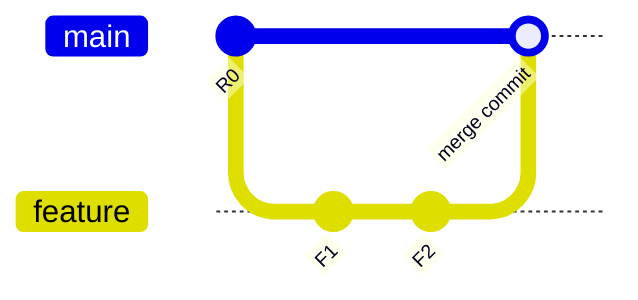
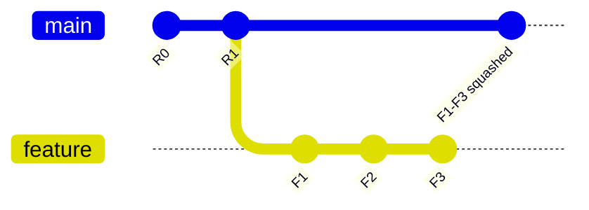
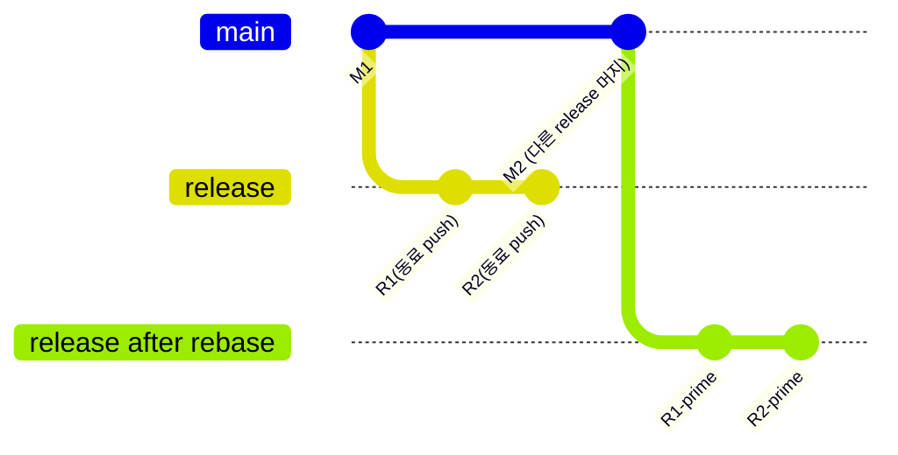
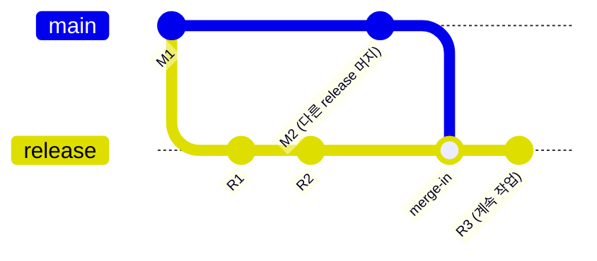

# 브랜치 전략 개편

## TL;DR

`release → main` 머지 후 남아있는 브랜치를 동기화하기 위해 반복하던 **rebase + force push 패턴이 커밋 누락의 근본 원인**이다. 이를 **merge 기반 동기화(merge-in)** 로 교체하고, **force push 권한을 회수**하며, `develop` 브랜치를 폐지해 재발 경로를 차단한다.

---

## 1. 문제 정의

### 1.1 현행 브랜치 전략

#### 브랜치 구성

| 브랜치 | 역할 |
|--------|------|
| `main` | 최신 프로덕션 브랜치 |
| `develop` | dev 환경 배포 브랜치 |
| `release/YYYY.MM.DD.NN` | 정기·비정기·핫픽스 배포 브랜치 |
| `feature/*` | 개발 기능 브랜치 |

#### 정기배포 흐름

1. `develop` → `release/YYYY.MM.DD.NN` 분기
2. `release`에서 `feature` 분기, 작업 완료 후 PR
3. `feature` → `release` **Squash merge**
4. `release` → `main` PR 생성 및 **Merge commit**
5. `main` 태깅 및 배포
6. `develop`과 잔여 `release` 브랜치들을 `main` 기반으로 **rebase + force push**

> **NOTE**: `release`를 `main`에서 분기하면? 배포 전에 `develop`에만 머지된 기능이 `release`에 포함되지 않는다. 이 때문에 현재는 `develop`을 베이스로 분기한다.

#### 비정기배포 흐름

1. `main` → `release/YYYY.MM.DD.NN` 분기
2. `release`에서 작업 완료 후 PR
3. `main`으로 **Merge commit**
4. `main` 태깅 및 배포
5. `develop`과 잔여 `release` 브랜치들을 `main` 기반으로 **rebase + force push**

---

### 1.2 사고 증상

`release → main` 머지 시 **커밋 누락** 사고가 반복 발생하고 있다.

누락은 주로 **release 브랜치**에서 발생한다. 새 릴리즈가 `main`에 머지되어 `main`이 전진하면, 팀원들은 남아있는 기존 release 브랜치를 최신 `main` 기준으로 맞추기 위해 `git rebase main` 후 `git push --force`를 실행한다. 로컬이 origin보다 stale한 상태에서 이 작업을 하면, 그 사이 다른 팀원이 push한 커밋이 force push에 의해 덮어써져 유실된다.

본 문서는 이 원인을 분해하고, **release 브랜치를 rebase하지 않아도 되는 전략**으로 개편하며, 예방·탐지·표준화·가시성 4개 축의 가드레일을 제안한다.

---

### 1.3 근본 원인

커밋 누락은 **release 브랜치를 main과 동기화하기 위한 rebase + force push** 에서 발생하며, 그 인과는 **트리거 → 파괴적 실행 → 미차단**의 3단계로 상호배타·전체포괄(MECE)하게 나뉜다.

```
release→main 커밋 누락의 원인
│
├── A. 동기화 트리거  (release 브랜치를 rebase할 이유가 생김)
│   ├── 새 release가 main에 먼저 머지되어 main이 전진
│   └── 남아있는 release 브랜치를 "최신 main 기준"으로 맞추려 함
│
├── B. 파괴적 실행  (rebase가 히스토리를 새로 써 force push가 강제됨)
│   └── 로컬이 origin보다 stale
│       → force push가 그 사이 release에 들어온 커밋을 덮어씀
│
└── C. 가드레일 부재  (A·B를 사전에 차단·탐지하지 못함)
    ├── release/develop 브랜치에 force push 권한 전원 보유
    ├── 머지 전 누락 커밋을 검증하는 단계 없음
    └── 팀원 간 git 숙달도 편차
        → 오진단(예: "Squash Merge 탓") 및 휴먼에러 지속
```

> **핵심**: 누락은 (A) rebase가 트리거되고 → (B) stale 상태로 파괴적으로 실행되며 → (C) 아무것도 막지 않아야 발생한다. 이 연쇄 밖의 누락 경로는 없다.

---

## 2. 배경 지식

> "Squash 머지가 충돌을 유발한다"는 의견이 있어 병합 방식을 정리한다.  
> 결론: **코드 병합 방식 자체는 충돌이나 커밋 누락을 유발하지 않는다.**

### 2.1 병합 방식별 동작

#### merge

| 옵션 | 동작 |
|------|------|
| `--no-ff` | fast-forward 가능 여부와 무관하게 항상 merge commit 생성. 브랜치 존재가 히스토리에 명시적으로 남는다 |
| `--ff` (기본) | fast-forward 가능하면 포인터만 이동(merge commit 없음), 불가능하면 merge commit 생성 |
| `--ff-only` | fast-forward 가능할 때만 병합 수행, 불가능하면 오류로 거부 |

#### squash merge

feature의 여러 커밋을 하나의 커밋으로 압축해 대상 브랜치에 추가한다. feature 브랜치의 커밋이 대상 히스토리에 직접 노출되지 않아 히스토리가 깔끔하다.

**⚠️ 주의**: 병합 후 feature 브랜치를 삭제하지 않으면 이후 재병합 시 충돌이 발생할 수 있다 — 이것이 "Squash Merge가 충돌을 유발한다"는 오해의 실제 원인이다. Squash 자체가 원인이 아니다.

#### rebase

feature의 커밋들을 대상 브랜치 끝에 **새 커밋으로 재작성**해 붙인다. 히스토리가 선형이 되지만, **이미 원격에 push된 브랜치에 rebase하면 커밋 해시가 바뀌어 force push가 강제된다.** 이것이 커밋 누락의 직접 경로다.

#### cherry-pick

특정 커밋만 골라 다른 브랜치에 복사한다. 긴급 핫픽스 백포트 등에 사용한다.

---

### 2.2 병합 과정 시각화

#### no-ff merge: feature → release

feature의 커밋이 히스토리에 그대로 남고, 명시적인 merge commit이 생성된다.



#### squash merge: feature → release

feature의 여러 커밋이 단일 커밋으로 압축되어 release에 추가된다. feature 브랜치의 커밋 상세는 release 히스토리에 남지 않는다. **병합 후 feature 브랜치를 반드시 삭제한다.**



#### rebase + force push: release를 main 기준으로 재작성 (현행 — 문제의 근원)

rebase는 기존 커밋을 새 커밋(R1′, R2′)으로 재작성한다. 원격에 push된 상태라면 force push가 필수가 되고, 그 사이 동료가 push한 커밋을 덮어쓸 수 있다.



> `R1′` `R2′` force push 시, 동료가 그 사이에 push한 `R3`이 원격에 있었다면 해당 커밋이 유실된다.

#### merge-in: main을 release에 병합 (개선안)

`git merge main`을 실행하면 새로운 merge commit이 생성된다. 기존 커밋 해시가 변경되지 않으므로 **force push가 전혀 필요 없다.**



---

### 2.3 오해 해소

| 오해 | 실제 원인 |
|------|-----------|
| "Squash merge가 충돌을 유발한다" | Squash 후 feature 브랜치를 삭제하지 않아 재병합 시 충돌 발생. 병합 방식 자체의 문제가 아님 |
| "Squash merge가 커밋 누락을 유발한다" | 누락은 rebase + force push에서 발생. Squash는 관련 없음 |
| "동기화하려면 rebase가 필요하다" | 동기화 트리거(A)를 제거하거나 merge-in으로 대체하면 rebase 자체가 불필요해짐 |

---

## 3. 개선 전략

### 3.1 새 브랜치 구성

| 브랜치 | 역할 | 변경 |
|--------|------|------|
| `main` | 최신 프로덕션 브랜치 | 유지 |
| `develop` | dev 환경 배포 브랜치 | **폐지** |
| `release/YYYY.MM.DD.NN` | 정기·비정기 배포 브랜치 | 유지 |
| `hotfix/YYYY.MM.DD.NN` | 핫픽스 전용 브랜치 | **신규** |

> `develop`은 "main이 전진하면 rebase로 따라잡는다"는 동일한 anti-pattern의 인스턴스다. 삭제함으로써 재발 경로를 함께 제거한다.  
> `hotfix/`를 `release/`와 네이밍으로 분리해 이력 추적을 명확히 한다.

---

### 3.2 동기화 방식 전환

**rebase + force push → `git merge main` (merge-in)**

다른 release가 `main`에 머지되어 `main`이 전진해도, 기존 release 브랜치는 그대로 두고 `git merge main`으로 변경을 흡수한다. 커밋 해시가 변경되지 않으므로 force push가 필요 없다.

---

### 3.3 새 브랜치 흐름

#### 정기배포

1. `main` → `release/YYYY.MM.DD.NN` 분기 *(변경: develop 대신 main에서 분기)*
2. `release`에서 `feature` 분기, 작업 완료 후 PR
3. `feature` → `release` **Squash merge**
4. `release` → `main` PR 생성 및 **Merge commit**
5. `main` 태깅 및 배포
6. **[자동화]** 갱신이 필요한 `release`/`hotfix` 브랜치들에 `main`을 **Merge commit** *(변경: rebase+force push → merge-in)*

#### 핫픽스

1. `main` → `hotfix/YYYY.MM.DD.NN` 분기
2. `hotfix`에서 `feature` 분기, 작업 완료 후 PR
3. `feature` → `hotfix` **Squash merge**
4. `hotfix` → `main` PR 생성 및 **Merge commit**
5. `main` 태깅 및 배포
6. **[자동화]** 갱신이 필요한 `release`/`hotfix` 브랜치들에 `main`을 **Merge commit**

---

### 3.4 원인 대응 매핑

| 근본 원인 | 개선 조치 | 효과 |
|-----------|-----------|------|
| A. 동기화 트리거 — rebase할 이유가 생김 | `develop` 폐지 + `main`에서 release 분기 | 동기화가 필요해도 merge-in으로 해결 → force push 트리거 제거 |
| B. 파괴적 실행 — rebase → force push | 동기화 방식을 `git merge main`으로 교체 | 커밋 해시 불변 → force push 불필요 |
| C. 가드레일 부재 — 차단·탐지 수단 없음 | force push 권한 회수 + 자동화 4축 | A·B가 발생하더라도 플랫폼 수준에서 파괴적 실행 차단 |

---

## 4. 이행

### 4.1 가드레일

#### force push 권한 회수

`release/*`, `hotfix/*`, `main` 브랜치에 대해 **팀원 전원의 force push 권한을 회수**한다. 권한은 플랫폼(GitHub/GitLab) 브랜치 보호 규칙으로 적용한다.

#### 자동화 4축 (개념·정책 수준)

| 축 | 목적 | 적용 지점 |
|----|------|-----------|
| **예방** | force push 자체를 플랫폼 수준에서 차단 | 브랜치 보호 규칙 설정 |
| **탐지** | `release → main` PR 생성 시 누락 커밋 유무를 자동 검증 | PR 생성 훅 또는 CI 단계 |
| **표준화** | rebase 대신 merge-in을 사용하는 동기화 절차를 문서화·스크립트화 | 팀 위키 + helper script |
| **가시성** | 자동 merge-in 완료/실패 여부를 채널에 알림 | CI → Slack 연동 |

> 각 축의 구체적인 도구 선택과 구현(YAML 등)은 전략 합의 이후 **후속 과제**로 진행한다.

---

### 4.2 전환 절차

#### 1단계: 브랜치 보호 규칙 적용 (즉시)

- `main`, `release/*`, `hotfix/*`에 force push 금지 규칙 설정
- `develop` 브랜치 보호 규칙도 동일하게 적용 (폐지 전까지 유지)

#### 2단계: 신규 release는 main에서 분기 (합의 즉시)

- 다음 스프린트부터 `develop` 대신 `main`에서 `release` 분기
- 기존 방식(`develop`에서 분기)은 더 이상 사용하지 않음

#### 3단계: 진행 중인 release 브랜치 처리

- 현재 `develop` 베이스로 작성 중인 `release` 브랜치가 있다면 배포 완료 후 종료
- 이후 분기는 모두 `main` 베이스 적용

#### 4단계: develop 브랜치 폐지

- 마지막 `develop`-베이스 release가 `main`에 머지된 시점에 `develop` 브랜치 아카이브(또는 삭제)
- 팀 공지 후 진행

---

### 4.3 검증

#### 성공 지표

- 전략 전환 후 릴리즈 **3회 연속 커밋 누락 0건**
- `release/*`, `hotfix/*`에 force push 시도 시 **플랫폼 수준 거부** 확인

#### 예상 리스크 및 대응

| 리스크 | 대응 |
|--------|------|
| merge-in 후 merge commit이 쌓여 히스토리가 복잡해짐 | release 브랜치 수명이 짧아 영향 제한적. 필요 시 main 머지 시 squash 적용으로 정리 |
| `develop` 폐지 후 dev 환경 배포 경로 불명확 | release 브랜치 직접 배포 또는 별도 CI 파이프라인으로 대체 — 팀 합의 필요 |
| 자동 merge-in 충돌 발생 시 블로킹 | 충돌은 수동 해소 후 재시도. 자동화는 성공/실패 알림만 담당 |

#### 롤백 기준

- 전환 후 merge-in 충돌로 배포 일정에 2회 이상 영향 발생 시 전략 재검토
- 긴급 상황에 force push가 필요한 경우: 팀 리드 승인 후 단건 허용 후 즉시 권한 회수

---

## 5. 결정 요청 / 다음 단계

### 합의가 필요한 항목

| 결정 항목 | 선택지 | 현재 제안 |
|-----------|--------|-----------|
| force push 권한 회수 범위 | 전원 / 특정 역할만 | 전원 (리드 포함) |
| `develop` 폐지 시점 | 즉시 / 마지막 develop-base release 종료 후 | 마지막 release 종료 후 |
| dev 환경 배포 대안 | release 직접 배포 / feature 브랜치 배포 / 전용 파이프라인 | 팀 논의 필요 |
| 자동화 4축 우선순위 | 어느 축부터 구현할지 | 예방(권한 회수) 즉시, 나머지는 후속 |

### 다음 단계 (합의 완료 후)

1. **[즉시]** 플랫폼 브랜치 보호 규칙 적용 (예방 축)
2. **[다음 스프린트]** `main` 베이스로 첫 release 분기 — 새 흐름 첫 적용
3. **[후속 과제]** 자동화 4축 구체 구현 (탐지·표준화·가시성 축 도구 선택 및 스크립트 작성)
4. **[후속 과제]** dev 환경 배포 파이프라인 대안 설계
